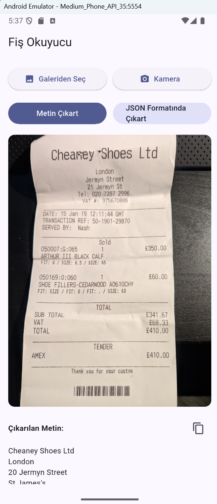
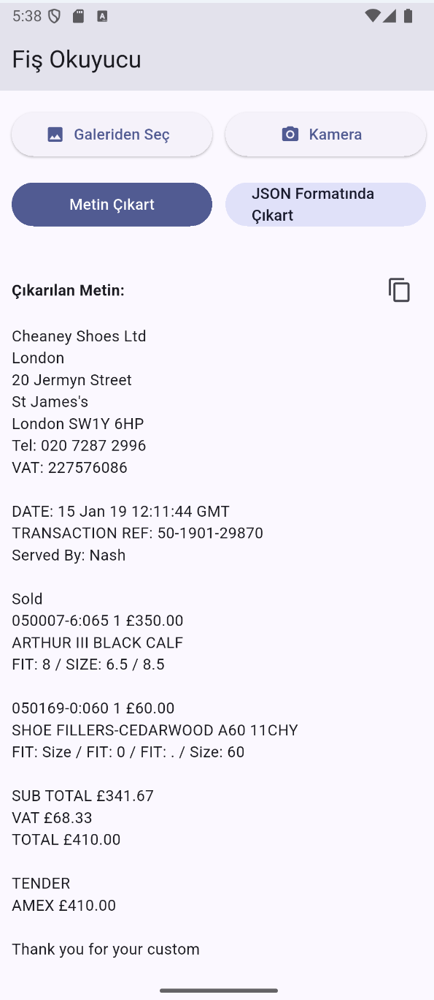
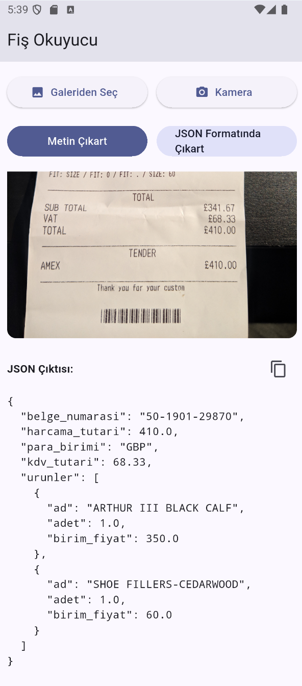

## Fiş/Fatura Okuyucu (xAI OCR)
Şirketlerin fatura kayıt süreçlerini kolaylaştırmak için geliştirilmiş basit Flutter uygulaması. Görsellerden metin ve fiş/faturalardan JSON çıkarır.

### Hızlı Başlangıç
```bash
flutter pub get
# env.sample dosyasını kopyalayıp adını .env yapın ve anahtarı ekleyin
flutter run
```

### .env
```dotenv
XAI_API_KEY=xx_your_key_xx
# (Opsiyonel) XAI_BASE_URL, XAI_MODEL, XAI_VISION_MODEL
```

### Kullanım
- Görsel seçin → "Metin Çıkart" veya "JSON Formatında Çıkart" düğmesini kullanın.

### Ekran Görüntüleri


<br>
<br>
<br>
<br>

<br>
<br>
<br>
<br>

<br>
<br>
<br>
<br>
### Gereksinimler
- Flutter 3.8+
- xAI API anahtarı
- cupertino_icons: ^1.0.8
- image_picker: ^1.1.2
- http: ^1.2.2
- path_provider: ^2.1.4
- flutter_dotenv: ^5.1.0

### Önemli Dosyalar
- `lib/main.dart`: UI
- `lib/services/xai_ocr_service.dart`: xAI çağrıları

